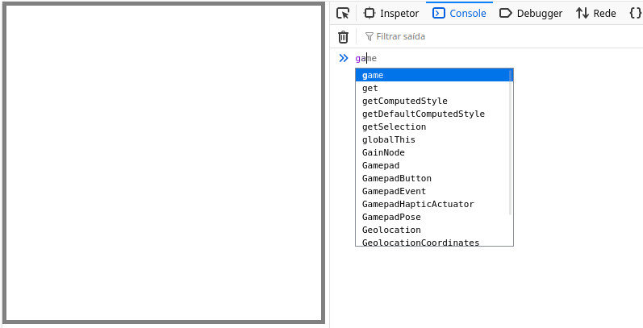
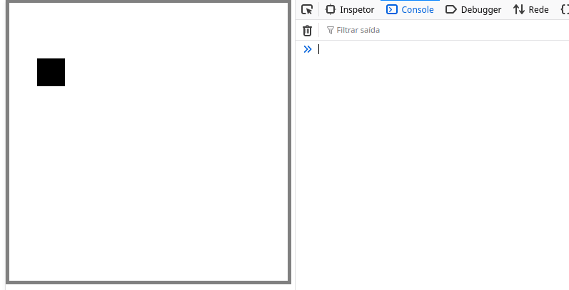
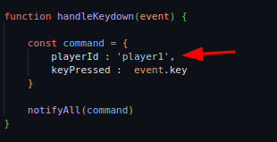
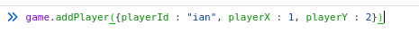
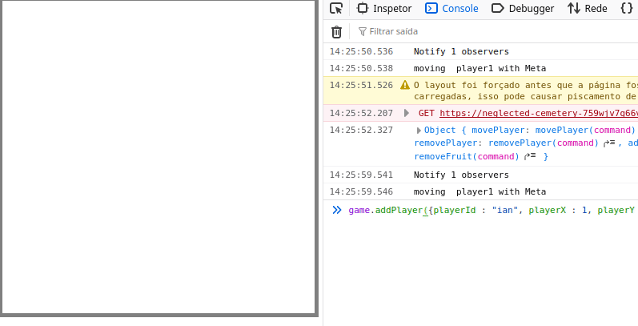
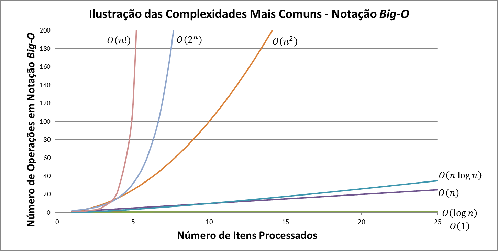
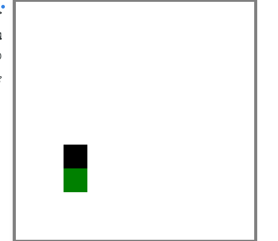

# Duvido você programar um algoritmo mais rápido que o meu

O que verá nesse cápitulo:

- Implementação de adição e exclusão de players e frutas de forma dinâmica;
- Implementação do sistema de colisão;
- Finalizando assim a camada de jogo.

Filipe começa com a seguinte afirmação:

[imagem do jogo com colisão para demostrar que nosso cerebro já vem econhece um algoritmo de colisão
mas quando mostra em estrutura de dados nção]

> "è engraçado porque a gente tem dificuldade de fazer em código algo que o nosso cerebro já sabe fazer
por natureza, o bom é que nesse vídeo a gente vai treinar exatamente isso..." Filipe Deschamps

Para finalizar a camada do jogo não falta muito, o MVP da camada de jogo seria:

- adicionar jogador;
- remover jogador;
- adicionar frutas;
- remover frutas;
- colisão.

## adição e remoção de players dinamicamente

Para começar a finalizar a camada de jogo vamos criar os metodos de adição e remoção de players e frutas

```js
function createGame() {
    const state = {
        players : [],
        fruits : []
    }
}
```

Começamos zerando o estado do jogo, já que agora ele será atualizado de forma dinâmica

```js
function createGame() {
    const state = {
        players : {},
        fruits : {}
    }

    function addPlayer(command) {
        state.players[command.playerId] = {
            x : command.playerX,
            y : command.playerY
        }
    }

}
```

Função super simples, perceba que padronizamos a "entidade" command como parâmetro de dependência, dessa forma evitamos confusões. command não necessariamente é uma entidade real, pois não instanciamos; ela é apenas uma padronização que implementamos no código.

```js
function createGame() {
    const state = {
        players : {},
        fruits : {}
    }

    function addPlayer(command) ...

    function removePlayer(command) {
        delete state.players[command.playerId]
    }

}
```

E assim agora adicionamos de forma dinâmica a criação e exclusão de players, basta fazer a mesma
coisa com as frutas. Não iremos desenvolver um método generico para isso pois
podemos deixar o código confunso, então por hora iremos separá-las.

```js
function createGame() {
    const state = {
        players : {},
        fruits : {}
    }

    //adição de player
    function addPlayer(command) {
        state.players[command.playerId] = {
            x : command.playerX,
            y : command.playerY
        }
    }
//remoção de player
    function removePlayer(command) {
        delete state.players[command.playerId]
    }
    //adição de fruitas
    function addFruits(command) {
        state.fruits[command.fruitId] = {
            x : command.fruitsX,
            y : command.fruitsY
        }
    }
    // remoção de frutas
    function removePlayer(command) {
        delete state.fruits[command.fruitsId]
    }

    ...

    return {
        movePlayer,
        state,
        addPlayer,
        removePlayer,
        addFruits,
        removeFruits
    } 
}
```

Por fim tornamos esses métodos publicos retornando eles! E essa parte está finalizada!



Ou pelo menos quase! o que acontece se adicionar um player com o código atual e aperta uma tecla de movimentação?



O código quebra! E o motivo é bem simples! olha esse trecho do nosso código?



Estamos dizendo em hardcode qual player estamos movendo, o problema acontece
quando o player adicionado não existe:



Seu playerId está como `"ian"` e tentamos mover o `"player1"` que não
existe no estado atual do jogo! Para isso vamos adicionar uma validação na
movimentação do player:

```js
function movePlayer(command) {
    console.log(`moving  ${command.playerId} with ${command.keyPressed}`)
    const player = state.players[command.playerId]


    const acceptMove = {
        ArrowUp(player) {
            console.log(`movePlayer.acceptMove -> Moving player to Up`)
            if ( player.y > 0) {
                player.y -= 1
            }
        },
        ArrowDown(player) {
            console.log(`movePlayer.acceptMove -> Moving player to Down`)
            if ( player.y + 1 < canvas.height ) {
                player.y += 1
            }
        },
        ArrowLeft(player) {
            console.log(`movePlayer.acceptMove -> Moving player to Left`)
            if (player.x - 1 >= 0) {
                player.x -= 1
            }
        }, 
        ArrowRight(player) {
            console.log(`movePlayer.acceptMove -> Moving player to Right`)
            if (player.x + 1 < canvas.width) {
                player.x += 1
            }
        }
    }

    const keyPressed = command.keyPressed
    const moveFunction = acceptMove[keyPressed]

    if (player && moveFunction) { // valida se o proprio player existe
        moveFunction(player)
    }
    
}
```

antes da chamada do método de movimentação verificamos se o player realmente existe,
só assim ela poderá ser executada!



## Sistema de colisão

> "As duas formas que eu vou trazer aqui são extremamente simples, mas elas vão nivelar todo mundo, pra daí, quem quiser da o próximo passo nesse tipo de otimização. A primeira forma vamos dizer que ela é "grosseira". E eu digo isso porque a gente vai criar um novo método que não recebe nenhum parâmetro e el vai verificar TUDO CONTRA TUDO! inclusive eu acho que não tem nem como fazer um jeito que fique mais pesado do que isso" - Filipe Deschamps

```js

function createGame() {
    ...

     if (player && moveFunction) {
        moveFunction(player)
        checkCollision() //verificando colisão
    }

    function checkCollision() {
        for (const playerIdCurrent in state.players) {
            const playerCurrent = state.players[playerIdCurrent]

            for (const fruitIdCurrent in state.fruits) { // O(n²)
                const fruintCurrent = state.fruits[fruitIdCurrent]

                if (playerCurrent.x == fruitCurrent.x && playerCurrent.y == fruitCurrent.y) {
                    deleteFruit({fruitId: fruitIdCurrent})
                }
            }
        }
    }
}

```

Bom, Essa é a primeira versão do código de colisão, funciona, porem é a maneira
mais performatica? Verificamos todos os players e logo em seguida percorremos por todas frutas.
O tempo em notação big O se não me engano é O(n²).  



Veja o quanto escala o tempo de execução conforme a entrada aumenta, isso é um
tempo O(n²). Mas como podemos melhorar ele com pouca alteração??

Eu acho que não é necessário verificar **TODOS OS PLAYER**, pensa comigo, se só vamos
chamar a função de colisão quando pressionar os botões de movimentação, o que significa que
só vamos verificar a colisão caso nosso personagem se mover, basta verificar a colissão com
esse player!! saindo de um tempo de execução O(n²) para O(n) que já é melhor.

```js
function createGame() {
    ...

    if (player && moveFunction) {
        moveFunction(player)
        checkCollision(player) //verificando colisão
    }


    function checkCollision(playerCurrent) {
       
        for (const fruitIdCurrent in state.fruits) { // O(n²)
            const fruintCurrent = state.fruits[fruitIdCurrent]

            if (playerCurrent.x == fruitCurrent.x && playerCurrent.y == fruitCurrent.y) {
                deleteFruit({fruitId: fruitIdCurrent})
            }
        }
    }
    
}
```

Dessa forma temos o sistema de colisão! Caso esse algoritmo fique insustentável
ao decorrer do projeto, voltamos e refatoramos ele.


