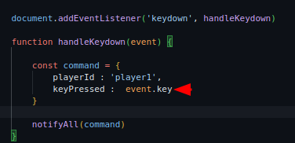
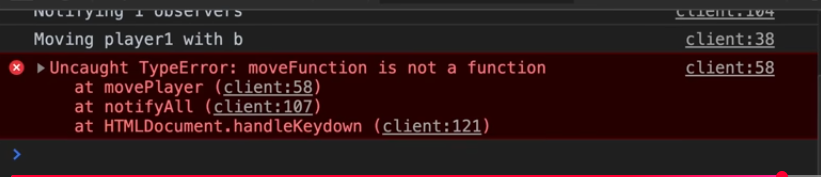

# Um Júnior já deveria saber como reduzir a quantidade de ifs de um código (e você, sabe?)

No último capitulo melhoramos significamente o código do jogo, mas 
ainda falta muitas coisas, após separar as lógicas das camadas utilizando
o **design pattern observer**, faltou da uma melhorada na lógica em si
da camada de regras de negócios do jogo!

```JavaScript
function movePlayer(command) {
    console.log(`moving  ${command.playerId} with ${command.keyPressed}`)
    const player = state.players[command.playerId]
    console.log("tamanho da altura do canvas", canvas.height)
    console.log(player)
    if (command.keyPressed == "ArrowUp" && player.y > 0) {
        player.y -= 1
    }

    if (command.keyPressed == 'ArrowDown' && player.y + 1 < canvas.height) {
        player.y += 1
    }
    
    if (command.keyPressed == 'ArrowLeft' && player.x - 1 >= 0) {
        player.x -= 1
    }

    if (command.keyPressed == 'ArrowRight' && player.x + 1 < canvas.width) {
        player.x += 1
    }
}

return {
    movePlayer,
    state
}
```

Assim está o código! Você consegue ver o problema?? Será a legibilidade do código?
duas condicionais no mesmo if? ou o próprio uso do if, e se não for usar o if, o que usar então?
swith case? mas... se usar swith case irá realmente resolver o problema? São essas indagações que  
Filipe propoe, para ele o real problema é idenficar o problema!

<quoteblock>
    Sabe qual é o real problema aqui? e é obvio que  podem ter vários outros problemas né?! Mas
    um que está gritante é aqui para cada nova input eu quiser aceitar no meu jogo para cada
    nova tecla precionada eu vou precisar  vim aqui e adicionar uma nova condicional.
    E eu não estou falando em ter que criar uma funcionalidade nova porque isso você não
    vai ter escapar... né é uma nova regra de negócio, vão ter as condicionais relacionadas
    a essa regra de negócio... mas o que eu estou falando é além disso. Além da regra de negócio
    você vai ter que programar MANUALMENTE! mais uma condicional para conseguir chegar nessa regra de
    negócio e quando a gente trata de inputs isso pode escalar muitooo rápido!

    <author>Filiphe Deschamps</author>
</quoteblock>

E a forma de que iremos aprender de implementar essas regras de inputs de forma
escalável é usando objects literals no javascript. Utilizando a **relação** **chave** e **valor**

```JavaScript
const pessoa = {
    name : "ian",
    idade : 20
}

pessoa["name"]
//output -> "ian"

```

Dessa forma podemos acessar o valor do atributo nome! E aí que vem a sacada! Esse valor
pode ser qualquer valor em javascript, o que significa que podemos colocar funções como valores
de propriedades! 

```JavaScript
const calculator = {
    sum : function(a, b) {
        return a + b
    }
}

calculator
// <- f (a, b) {return a + b}

calculator["sum"](2, 2) 
// output -> 4

//outra forma seria essa
const somar = calculator.sum
somar(2, 2)
// output -> 4
```
Então se o parametro keyPressed do command tem valores
fixos como 'ArrowDown', 'ArrowUp', 'ArrowLeft' e 'ArrowRight'
por que não casamos esses nomes como chaves e os valores como
funções?



O JavaScript tem um novo recurso muito interessante! se liga:

```JavaScript
///camada do jogo

const acceptMovies = {
    ArrowUp(player) {
        console.log(`move ${player} to Up`)
    },
    ArrowDown(player) {
        console.log(`move ${player} to Down`)
    },
    ArrowLeft(player) {
        console.log(`move ${player} to left`)
    },
    Arrowight(player) {
        console.log(`move ${player} to right`)
    }    
}


```

O javaScript irá reutilizar os nomes das funções como nomes das propriedades do objeto!
Facilitando a escrita e agilizando o trabalho. Dessa forma, ao omitir os valores da chaves do objeto:

```Javascript
const acceptMove = {
    arrowDown : function() {
        console.log(`move ${player} to Up`)
    }
    ...
```

Basta simplesmente omitir a nome da propriedade(chave do valor) e colocar uma função
com um identificador dessa forma:

```JavaScript
const acceptMove = {
    ArrowUp(player) {
        console.log(`move ${player} to Up`)
    }
    ...
```

Agora refatorando o código da camada de jogo ficará algo parecido com isso!

```JavaScript
///camada do jogo
function createGame(command) {
    ...
    const acceptMovies = {
        ArrowUp(player) {
            console.log(`move ${player} to Up`)
        },
        ArrowDown(player) {
            console.log(`move ${player} to Down`)
        },
        ArrowLeft(player) {
            console.log(`move ${player} to left`)
        },
        Arrowight(player) {
            console.log(`move ${player} to right`)
        }

        
    }

    const moveFunction = acceptMove[command.keyPressed]
    moveFunction(player)

    return {
        acceptMove,
        state
    }
}
```

Mas o que acontece quando precionamos uma tecla "b" por exemplo? Não criamos nenhuma
propriedade com esse valor no nosso acceptMove. O que irá acontecer??



O código **quebra!** e que bom! até porque em nenhum momento falamos
para o código que ele iria reconhecer a funcionalidade correspondente a tecla "b",
mas agora uma outra questão surgi, como evitamos que o código enlouqueça? criamos uma
lista de teclas aceitas e filtramos na camada de inputs? tá certo isso? a camada de inputs
não foi criada para escutar as entradas? pelo menos é isso que seu identificador diz. São
essas perguntas que o Filipe indaga.

```JavaScript
///camada do jogo
function createGame(command) {
    ...
    const acceptMovies = {
        ArrowUp(player) {
            console.log(`move ${player} to Up`)
        },
        ArrowDown(player) {
            console.log(`move ${player} to Down`)
        },
        ArrowLeft(player) {
            console.log(`move ${player} to left`)
        },
        Arrowight(player) {
            console.log(`move ${player} to right`)
        }

        
    }

    const moveFunction = acceptMove[command.keyPressed]
    if (moveFunction) { // valida se existe essa tecla
        moveFunction(player)
    }

    return {
        acceptMove,
        state
    }
}
```

Para nos proteger de qualquer coisa, iremos validar se a tecla é aceita no metodo MovePlayer verificando
se a propriedade que vim do keyboardListenner corresponde as teclas que o player aceita colocando apenas uma verificação simples:

```JavaScript
    ...
    //camada do jogo
    const moveFunction = acceptMove[command.keyPressed]

    if (moveFunction) { // valida se existe essa tecla
        moveFunction(player)
    }

    return {
        acceptMove,
        state
    }

```


Agora basta casar os valores dos inputs com a pespectiva regra de negócio!
substituindo os ifs:

```JavaScript
//camada de jogo 
functin createGame(command) {
    ...

    const acceptMove() {
        ArrowUp(player) {
            console.log(`player moving to Up`)
            if (player.y > 0) {
                player.y -= 1
            }
        },
        ArrowDown(player) {
            console.log(`player moving to Down`)
            if (player.y + 1 < canvas.height) {
                player.y += 1
            }
        },
        ArrowLeft(player) {
            console.log(`player moving to Left`)
            if (player.x - 1 >= 0) {
                player.x -= 1
            }
        },
        Arrowight(player) {
            console.log(`player moving to Right`)
            if ( player.x + 1 < canvas.width) {
                player.x += 1
            }
        }
    }

    const moveFunction = acceptMove[command.keyPressed]
    moveFunction(player)

    return {
        acceptMove,
        state
    }

}

```

## Código refatorado!

```JavaScript
const canvas = document.querySelector("#screen")

const contextScreen = canvas.getContext('2d')


function createKeydownListenner() {

    const state = {
        observers : []
    }

    function subscribe(observerFunc) {
        /*
            essa função faz a inscrição para o subject keyboardListenner
        */
        state.observers.push(observerFunc)
    }

    /*
    * @description essa função faz a inscrição para o subject keyboardListenner
    */
    function notifyAll(command) {
        console.log(`Notify ${state.observers.length} observers `)
        for (const observerFunc of state.observers) {
            observerFunc(command)
        }
    }


    document.addEventListener('keydown', handleKeydown)

    function handleKeydown(event) {
        
        const command = {
            playerId : 'player1',
            keyPressed :  event.key
        }

        notifyAll(command)
    }

    return {
        subscribe
    }

}

function createGame() {
    
    const state = {
        players : {
            'player1' : {
                x : 1,
                y : 1
            },
            'player2' : {
                x : 9,
                y : 9
            }
        },
        fruits : {
            'fruit1' :  {
                x : 4,
                y : 1
            }
        }
    }

    function movePlayer(command) {
        console.log(`moving  ${command.playerId} with ${command.keyPressed}`)
        const player = state.players[command.playerId]


        const acceptMove = {
            ArrowUp(player) {
                console.log(`movePlayer.acceptMove -> Moving player to Up`)
                if ( player.y > 0) {
                    player.y -= 1
                }
            },
            ArrowDown(player) {
                console.log(`movePlayer.acceptMove -> Moving player to Down`)
                if ( player.y + 1 < canvas.height ) {
                    player.y += 1
                }
            },
            ArrowLeft(player) {
                console.log(`movePlayer.acceptMove -> Moving player to Left`)
                if (player.x - 1 >= 0) {
                    player.x -= 1
                }
            }, 
            ArrowRight(player) {
                console.log(`movePlayer.acceptMove -> Moving player to Right`)
                if (player.x + 1 < canvas.width) {
                    player.x += 1
                }
            }
        }

        const keyPressed = command.keyPressed
        const moveFunction = acceptMove[keyPressed]

        if (moveFunction) {
            moveFunction(player)
        }
        
        
    }
    
    return {
        movePlayer,
        state
    }
    
}

const game = createGame()
console.log(game)
const keyboardListener = createKeydownListenner()
keyboardListener.subscribe(game.movePlayer)
renderstate()
function renderstate() {

    //clear screen
    contextScreen.clearRect(0,0, 10, 10) // mais performatico que apenas redesenhar um react ta tela inteira


    for (const playerId in game.state.players) {
            let currentPlayer = game.state.players[playerId]
        contextScreen.fillStyle = "black"
        contextScreen.fillRect(currentPlayer.x, currentPlayer.y, 1, 1)
    }

    for (const fruitId in game.state.fruits) {
        let currentFruit = game.state.fruits[fruitId]
        contextScreen.fillStyle = "green"
        contextScreen.fillRect(currentFruit.x, currentFruit.y, 1,1)
    }

    requestAnimationFrame(renderstate) // chama o método, fazendo com que atualize a tela a todo frame
}
```

## Navegação //------

<a href="./VoceNuncaMaisVaiConseguirLerUmCodigoDaMesmaForma.md">Anterior</a> | <a href="">Próximo</a>