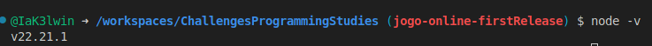
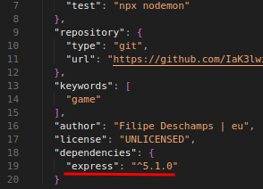
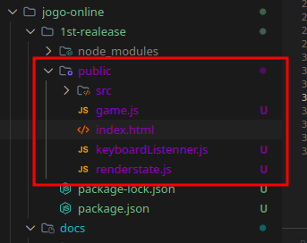
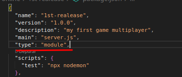
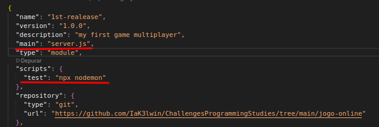

# Me veja programando um backend que troca informações em tempo real

Amigos, finalmente estamos perto de acabar e agora vamos para uma parte muito legal!
Vamos **começar a desenvolver nosso backend**. Primeira coisa que iremos fazer é preparar o nosso ambiente para
receber essas mudanças. Vamos verificar se nosso node está atualizado:



Caso você tenha um node abaixo da versão 13, atualize usando o comando `nvm install node`. Insira algumas informações e com o processo finalizado um arquivo chamado package.json deve surgir.
Agora com node atualizado vamos inicializar um projeto node com o comando `npm init` instalar o módulo `express` para criar um api:

`npm install express` - com isso uma nova dependência no nosso projeto é gerada!



## Reorganizando nosso projeto

Inicialmente criei uma pasta chamada **public** e levei todos arquivos públicos para ela
renomeando o arquivo `client.html`para `index.html`, fiz isso pois agora vamos servir esses
arquivos de forma estática pelo servidor.



Fora da pasta `public` vamos criar um novo arquivo chamado server.js, nele que vamos criar
nosso servidor.

Javascript não é minha linguagem principal, ou pelo menos não a que quero. Então não entendo muito
dos framework. Mas irei estudar a documentação para melhor explicar o que está acontecendo, com o arquivo criado vamos iniciar o setup do express.

```js
import express from "express" // 1
import http from "http" // 2

const app = express() // 3
const server = http.createServer(app) // 4

app.use(express.static("public")) / 5

app.listen(3000, () => { // 6
    console.log("Server listening with port 3000")
})
```

Para facilitar o entendimento comentei números correspondente a cada instrução de código,
nas instruções 1 e 2 estamos simplesmente dizendo que vamos usar esses carinhas para
construir nosso código. Na linha 3 estou criando nossa instancia do express, e criamos uma
para nosso server. Na 4 linha finalmente dizemos a nossa API que vamos servir os arquivos
de forma estática.

## Trocando informações em tempo real com o client e o servidor


Todo server pode e deve se conectar com vários clients e trocar informações,para isso vamos usar um outro
módulo chamado **socket.io**, uma coisa importante que devo enfatizar aqui é não importa o fluxo de dados que
aconteça nos **clients** as únicas informações que devem valer é a do **servidor**, até porque os dados dos clients não devem serem confiadas nunca! Pois o usuário tem acesso total aos dados do client podendo alterar o quanto quiser.

## Levando o state do game para o backend

Para isso única coisa necessária é importar nossa factory do game e criá-la no backend!
O mais incrível é que estamos reaproveitando todo código feito anteriomente!

```js
import express from "express"
import http from "http"
import createGame from "./public/game.js"

const app = express()
const server = http.createServer(app)

const game = createGame()
game.addFruit({fruitId : 'fruit1', fruitX : 3, fruitY : 2})
game.addFruit({fruitId : 'fruit2', fruitX : 2, fruitY : 7})
game.addPlayer({playerId : 'player1', playerX : 0, playerY : 0})

app.use(express.static("public"))


app.listen(3000, () => {
    console.log(game.state)
    console.log("Server listening with port 3000")
})
```

### Detalhe importante

Prestando atenção no terminal, reparei uma mensagem de aviso do node dizendo o seguinte:

```bash
(node:76318) [MODULE_TYPELESS_PACKAGE_JSON] Warning: Module type of file:///workspaces/ChallengesProgrammingStudies/jogo-online/1st-realease/server.js is not specified and it doesn't parse as CommonJS.
Reparsing as ES module because module syntax was detected. This incurs a performance overhead.
To eliminate this warning, add "type": "module" to /workspaces/ChallengesProgrammingStudies/jogo-online/1st-realease/package.json.
```

Resumindo, node não sabe que tipo de modulo estamos usando, cometi um leve deslice em esquecer de avisar
e configurar isso. Quando criamos um projeto node vimos que ele gera um arquivo chamado `package.json`,
precisamos configurar o typo do projeto para module.



## Pense no sistema de forma abstrata

Lembra que nos últimos cápitulos estamos reforçando muito a questão de pensar de forma
abstrata, de certa forma é a maneira que um programador deve pensar principalmente ao desenvolver
sistemas como esse, com isso podemos mover um player em nosso backend de forma abstrata!

```js
...

game.addPlayer({playerId : 'player1', playerX : 0, playerY : 0})

// movendo o player de forma abstrata
game.movePlayer({playerId : 'player1', keyPressed : 'ArrowDown'})

app.use(express.static("public"))


app.listen(3000, () => {
    console.log(game.state)
    console.log("Server listening with port 3000")
})

```

### Saída

```bash
{
  players: { player1: { x: 0, y: 1 } },
  fruits: { fruit1: { x: 3, y: 2 }, fruit2: { x: 2, y: 7 } },
  canvas: { width: 10, height: 10 }
}
Server listening with port 3000

```

## Detalhes de implementação

Estavamos evitando o acoplamento o projeto todo, mas ironicamente criamos o maior
acoplamento do sistema inteiro! Acoplamos o client ao servidor! Atrávez do `game.js`
e **CUIDADO**, isso pode abrir brechas perigosas para o sistema, ou você sabe o que está
fazendo ou fará uma besteira sem tamanha. Outra coisa que vale salientar é: **A lógica e regras do jogo estão EXPOSTAS no client**, pois o arquivo que contém ela é compartilhado. Para esse jogo não tem problema
as regras estarem públicas, entretando a depende do jogo isso pode não ser uma boa ideia.
A exclusividade ao backend também morre nessa abordagem, a não ser que uma arquitetura realmente desacoplada.

Para executar o projeto estou usando um script configurado no `package.json` que chamo de test,
ele executa o comando `npx nodemon` que recarrega o servidor caso ele sofra alterações, o nodemon sabe qual arquivo executar por conta da configuração do `package.json`.



> "Quando um client quer se conectar no nosso server isso significa que ele tá querendo se conectar no jogo, correto? Então a primeira coisa que a gente precisa assumir é que já tem um jogo rodando lá no servidor. O jogo ele não inicia quando entra alguém, sempre ele tá rodando, sempre vai ter um jogador lá ou uma frutinha.O que seja, e para nós na posição de um novo jogador entrando nesse jogo. A gente precisar saber IMEDIATAMENTE como é que esse jogo está, para a gente poder continuar jogando, então a primeira coisa que a gente precisa fazer é: Assim que o jogador entrar ele vai receber em uma paulada só todo o state do backend." - Filipe Deschamps

## Introduzindo o socket.io

Para começar instalamos o socket.io com
