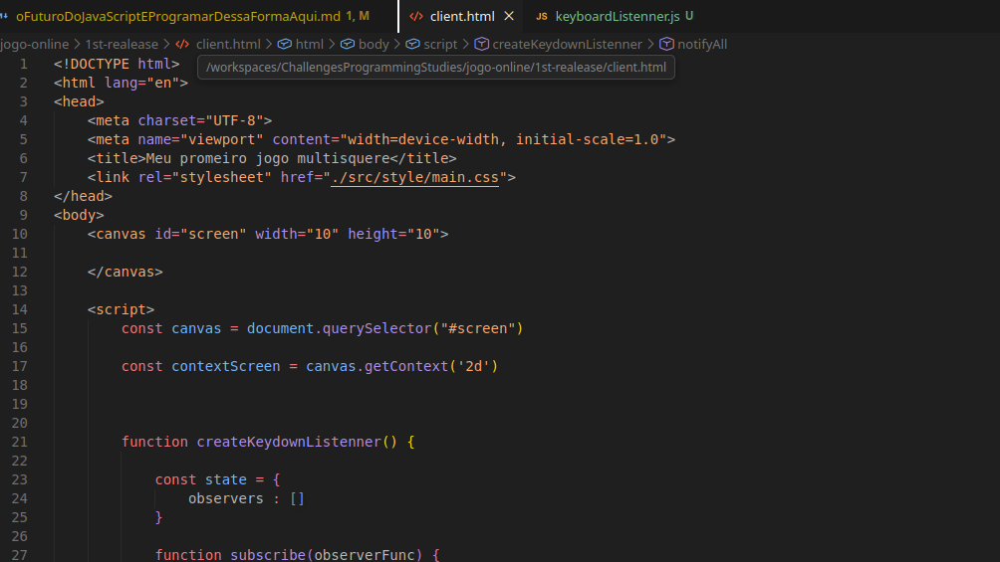
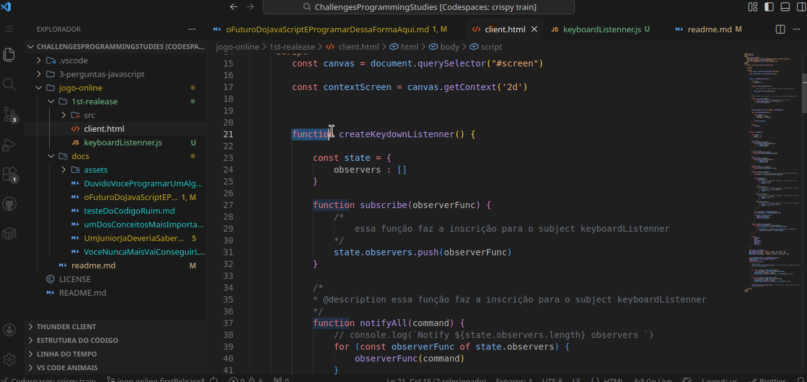
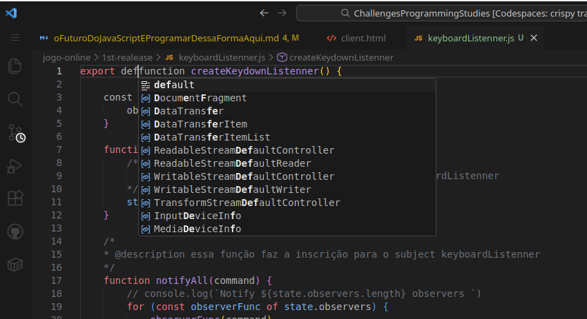
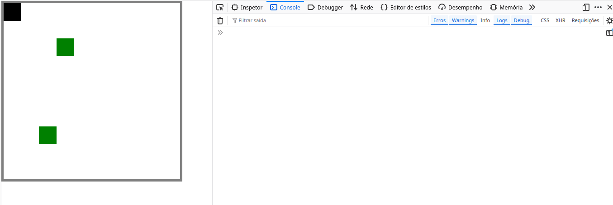

# O futuro do javascript é programar dessa forma aqui

Nas páginas anteriores, já estava incomodando a quantidade de código
em um único arquivo, que são de camadas diferentes além de que, a quantidade
de código está dificultando a leitura.



## Chegou a hora de fatiar tudo isso

> "Bom, chegou a hora da gente fatiar tudo isso. Uma forma **antiga** de você separar código em arquivos era simplemente recortar aquele trecho de código e colar dentro de um arquivo separado, então eu vou fazer um exemplo aqui com keyboardListenner... " -- Filipe Deschamps



O que fizemos? separamos o código do keyboardListener em um arquivo
e invocamos ele com a tag script. O que o navegador faz é simples,
ele esbarra com uma tag `<script></script>`, vê o `src` e baixa o arquivo logo em seguida
executa, assim ele fica um script global.

```js
...

const game = createGame()
game.addFruit({fruitId : 'fruit1', fruitX : 3, fruitY : 2})
game.addFruit({fruitId : 'fruit2', fruitX : 2, fruitY : 7})
game.addPlayer({playerId : 'player1', playerX : 0, playerY : 0})


const keyboardListener = createKeydownListenner() // <----
keyboardListener.subscribe(game.movePlayer)
renderstate()
...
```

Com isso quando chamamos a função `createKeydownListenner()` ele não quebra,
pois essa função já foi baixada e executada.

## Problemas com essa abordagem

### Main thered

Primeiro que ela pode bloquear a **"Main Thread"**, que a depender do tamanho do script
pode **impedir a renderização da página**, em que tempos mordernos basta passar
2 segundos que a probabilidade do usuário sair é significamente grande. Com tudo os devs
começaram a mover a tag que invoca scripts para o final do body das páginas,
que gera outro problema.

### Scripts não invocados

```html
<head>
    <script src="functionExemple1.js"></script>
</head>

<body>

    <p>content site</p>

    <script>
        functionExemple1() // <- chama função 1
        functionExemole2() // <- chama a funçao 2>
    </script>


    <script src="funcitonExemple2.ts"></script>
</body>

```

Nesse caso, o que aconteceria? O código **retornaria um error!** Pois a função `functionExemple2` ainda **não foi baixada e nem executada**. A ordem em que a tag
`script` é chamada é sincrona. O que significa que ela só será baixada e executada quando
o navegador processar aquela tag, além de que como não são módulos separados, são literalmente scripts globais que se o projeto for complexo pode ter uma quantidade gigantesca
de métodos, variáveis e classes globais, que confusão isso seria!

## Breve história da evolução do javaScript

No vídeo do Filipe ele conta com mais detalhe(não muito também), mas resumindo bem!
**Levaram o javaScript para o backend**, houveram várias tentativas, mas a que floreceu
foi o NodeJs. Com o surgimento do nodejs veio também o **commonJs** que foi a maneira
que o node "modularizou" o javascript. Mas o javascript nativo ainda não tinha esse tipo de funcionalidade, então daí os devs da época tiveram uma sacada: "O backend é javascript com módulos e o frontend é javascript sem módulos, Já sei! Só escrever o código do frontend também usando módulos e aí usamos algo para transforma esse código de uma forma que ele fique válido pro navegador.", e para organizar essa quantidade de soluções surgiu o **ECMAScript Modules (ESM)** e isso ficou disponível por padrão no javascript nativo. Mas o que diacho é um módulo?

## Módulos no javascript

Módulos são uma espécie de **"sala" privada**, onde seus códigos podem ser criados e que cujo
seu **acesso é restrito apenas o própria "sala"**, mas com a capacidade de **poder "Emprestar" suas ferramentas**. Imagine que cada sala tenha um chefe de sala que diz o que pode ser emprestado ou não, e que se poder ele diz: "aqui na minha sala tem tal coisa, que eu deixo ela exposta para quem quiser usá-la".

## Transformando o keyboardListanner em módulo

Para isso é bem simples, basta a frente da declaração da função inserir a palavra chave `export default`:



```js
export default function createKeydownListenner() {

    const state = {
        observers : []
    }

    function subscribe(observerFunc) {
        /*
            essa função faz a inscrição para o subject keyboardListenner
        */
        state.observers.push(observerFunc)
    }

    /*
    * @description essa função faz a inscrição para o subject keyboardListenner
    */
    function notifyAll(command) {
        // console.log(`Notify ${state.observers.length} observers `)
        for (const observerFunc of state.observers) {
            observerFunc(command)
        }
    }


    document.addEventListener('keydown', handleKeydown)

    function handleKeydown(event) {
        
        const command = {
            playerId : 'player1',
            keyPressed :  event.key
        }

        notifyAll(command)
    }

    return {
        subscribe
    }

}
```

## Importando o novo módulo no script do client

Para importa basta dizer que o script é do tipo módulo:

```html
...
        <script type="module">
            ...
        </script>
    </body>
</html>

```

Isso se torna necessário pois para **`exportar`** um módulo, o script
que for usá-lo obrigatoriamente tem que ser um módulo. Agora basta dizer que
você que **`importar`** um módulo:

```html

    ...
        <script type="module">
            import createKeyboardListenner from "file_path.js"

            ...
        </script>
    </body>
</html>
```

Agora é possível utilizar o keyboardListenner sem nenhum problema! Lembrando que as unicas coisas que podemos usar do arquivo é aquilo que deixamos público atrávez da palavra reservada `export`.

## Fazendo esse processo nas outras camadas

Transformando os outros arquivos em módulos e deixando os métodos públicos
separamos as camadas organizando nossos códigos.

Ao fazer esse processo com a camada de jogo, importar em nosso arquivo script principal
nos deparamos com um problema! As variáveis globais!



Isso acontece porque tentamos acessar a variável `canvas` que antes era glogal, a camada de jogo tentava
encontrar a variável no escopo local, não encontrava batia no global e ela existia. Mas agora estamos dentro de um módulo
e a camada de jogo está isolada!

> "A camada de jogo precisa por conta própria definir e conhecer a sua dimensão Lembra daquela tecnica que a gente
aprendeu nos vídeos passados? sobre pensar de forma abstrata, É EXATAMENTE isso! Não pense no jogo de uma forma aplicada em uma tela num canvas, pense de forma abstrata com propriedades como ele poderia anotar
essas informaçõoes mais ou menos dessa forma aqui" - Filipe Deschamps

```js
const state = {
    players : { },
    fruits : {},
    canvas : {
        width : 10,
        height : 10
    }
}

...
```

Acessando a propriedade onde antes tentava acessar a variável.

```js
export default function createGame() {
    
    const state = {
        players : { },
        fruits : {}
    }

    //add player
    function addPlayer(command) {
        state.players[command.playerId] = {
            x : command.playerX,
            y : command.playerY
        }

    }
    // remove player
    function removePlayer(command) {
        delete state.players[command.playerId]
    }

    //add fruit
    function addFruit(command) {
        state.fruits[command.fruitId] = {
            x : command.fruitX,
            y : command.fruitY
        }
    }
    //remove fruit
    function removeFruit(command) {
        delete state.fruits[command.fruitId]
    }

    function movePlayer(command) {
        // console.log(`moving  ${command.playerId} with ${command.keyPressed}`)
        const player = state.players[command.playerId]


        const acceptMove = {
            ArrowUp(player) {
                // console.log(`movePlayer.acceptMove -> Moving player to Up`)
                if ( player.y > 0) {
                    player.y -= 1
                }
            },
            ArrowDown(player) {
                // console.log(`movePlayer.acceptMove -> Moving player to Down`)
                if ( player.y + 1 < state.canvas.height ) {
                    player.y += 1
                }
            },
            ArrowLeft(player) {
                // console.log(`movePlayer.acceptMove -> Moving player to Left`)
                if (player.x - 1 >= 0) {
                    player.x -= 1
                }
            }, 
            ArrowRight(player) {
                // console.log(`movePlayer.acceptMove -> Moving player to Right`)
                if (player.x + 1 < state.canvas.width) {
                    player.x += 1
                }
            }
        }

        const keyPressed = command.keyPressed
        const moveFunction = acceptMove[keyPressed]

        if (player && moveFunction) {
            moveFunction(player)
            checkCollision(player)
        }
        
    }

    function checkCollision(player) {
        for (const fruitCurrentId in state.fruits) {
            const fruitCurrent = state.fruits[fruitCurrentId]

            if (fruitCurrent.x === player.x && fruitCurrent.y === player.y) {
                removeFruit({fruitId : fruitCurrentId})
            }
        }
    }
    
    return {
        movePlayer,
        state,
        addPlayer,
        removePlayer,
        addFruit,
        removeFruit
    }
    
}
```

> "E turma o que eu falei antes sobre **pensar de forma anbstrata**, **isso é sério tá**  Todo esse código aqui ele vai ter que rodar lá no **backend e lá não tem tela** não tem canvas **é só informação abstrata** e mesmo assim ele vai precisar **fazer todos os calculos da colisões** da mesma forma." -- Filipe Deschamps

## Separando as outras partes

### RenderScreen

Cuidado para não cair na armadilha das variáveis globais!

renderScreen.js |
'--------------------------'

```js
export default function renderstate(contextScreen, game) {

    //clear screen
    contextScreen.clearRect(0,0, 10, 10) // mais performatico que apenas redesenhar um react ta tela inteira


    for (const playerId in game.state.players) {
            let currentPlayer = game.state.players[playerId]
        contextScreen.fillStyle = "black"
        contextScreen.fillRect(currentPlayer.x, currentPlayer.y, 1, 1)
    }

    for (const fruitId in game.state.fruits) {
        let currentFruit = game.state.fruits[fruitId]
        contextScreen.fillStyle = "green"
        contextScreen.fillRect(currentFruit.x, currentFruit.y, 1,1)
    }

    requestAnimationFrame(() => {
        renderstate(contextScreen, game)
    }) // chama o método, fazendo com que atualize a tela a todo frame
}
```

## FIM

### Navegação //-----------

[Anterior](./DuvidoVoceProgramarUmAlgoritmoMaisRapidoQueOMeu.md) | [Próximo](../readme.md)
