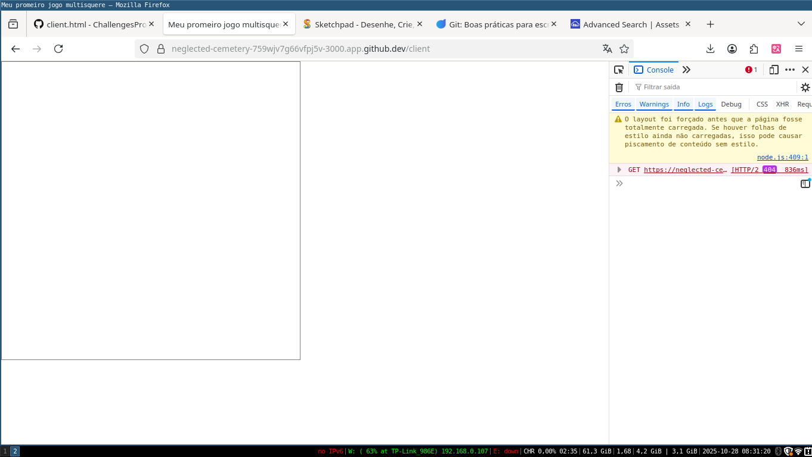
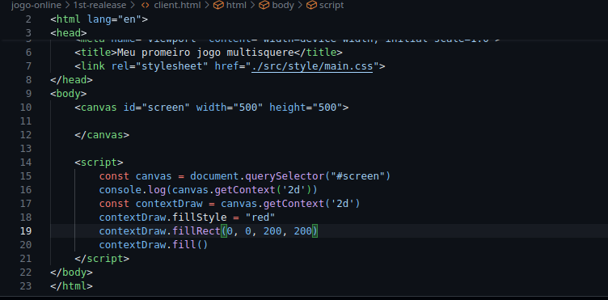
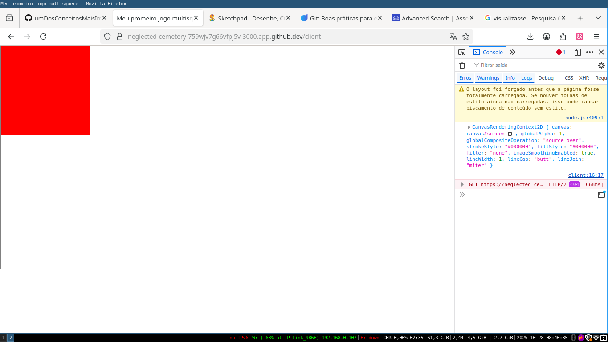
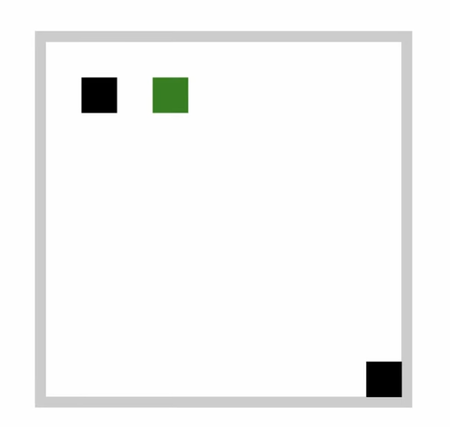
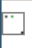
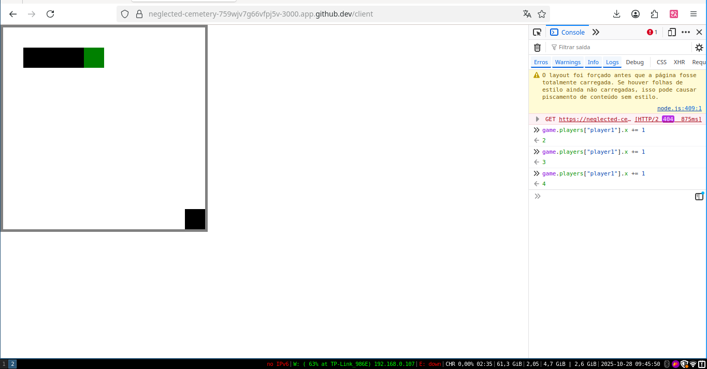

# Separation of Concerns

  Nessa parte você irá aprender esse paradigma de programação, além de explorar o canvas do HTML
que levará você para o próximo nível!

Inicialmente o Filipe cria um novo diretorio com a primeira realease do projeto criado um client.html, ele ultiliza o canvas com 500px de largura e altura com uma borda cinza. 


E inicia o arquivo estático usando o serve, um comando que vem por padrão no npx:

```
@IaK3lwin ➜ /workspaces/ChallengesProgrammingStudies/jogo-online/1st-realease (jogo-online-firstRelease) $ npx serve
Need to install the following packages:
serve@14.2.5
Ok to proceed? (y) y
 ERROR  Cannot copy server address to clipboard: Both xsel and fallback failed.

   ┌─────────────────────────────────────────┐
   │                                         │
   │   Serving!                              │
   │                                         │
   │   - Local:    http://localhost:3000     │
   │   - Network:  http://10.0.11.204:3000   │
   │                                         │
   └─────────────────────────────────────────┘
 ```

 


  Logo após ele pede pra que esqueçamos do navegador e do canvas, e visualizasse uma tela com
500px de altura e largura com um quadrado de 200px com fundo vermelho. visualizar a camada de presentação! Apenas com os dados que o Filipe apresentou. Bom vários cerebros com as mesmas informações que o Filipe passsou e visualizaram de formas diferentes, e segundo ele próprio isso não é bom.

  Ele então começa a programar o que tinha dito, então eu pausei o vídeo e fui tentar 
representar a camada de apresentação com as informações que o Filipe descreveu, Não sabia
usar o canvas e seus métodos então consultando a documentação cheguei a esse resultado:





CARALHOOOO!! né que visualizei certo :D

## Próximo desafio!

  Os dados do quadrado estão jogados pelo código, e isso não é interessante. Logo Filipe
nos desafia a pensar em uma estrutura de dados que componha esse canvas:



  Analisando a imagem, só consigo imaginar um objeto para a tela
que contem os jogadores com sua posição, cor etc... Algo como isso:

```
Screen:
    X : 10
    Y : 10
    player1:
        color : 'red'
        X : 1
        Y : 1
    player2:
        color : 'red'
        X : 10
        Y : 10
    fruits:
        [
            color : 'red'
            X : 3
            Y : 1
        ]

```

  Mas sendo bem sincerro, não acho que seja a solução certa. Até porque 
o paradigma que veremos nesse vídeo se chama "SEPARATION OF CONCERNS"
então acho pouco provável.

### Solução do Filipe
  A solução dele foi parecida, mas não igual. Talvez no subonciente por conta de já
ter me esbarrado com a solução dele meu cerebro fez algo parecido, não sei. Um fato 
interessante é que minha memória é horrível então não sei se foi exatamente isso.

```
const game = {
    players : {
        player1 : {x:1, y : 1},
        player2 : {x : 9, y : 9}
    },
    fruits : {
        'fruta1' : {
            x : 3,
            y : 1
        }
    }
}

```

  E como ele pode pegar o elemento do player por id via Javascript é possível mudar
a cor do player do navegador e dos outros player. Deixando a responsabilidade de
pintar os objetos a camada de apresentação.

### Desenhando o canvas apartir da estrutura de dados

  Então se para desenhar um quadrado no canvas bastas preencher o quadrado e
desenhar um quadrado com a posição e o tamnho só precisamos extrair as informações 
da estrutura de dados e passar seus valores para o canvas:

```
function renderGame() {
    for (let playerId in game.players) {
            let currentPlayer = game.players[playerId]
        contextGame.fillStyle = "black"
        contextGame.fillRect(currentPlayer.x, currentPlayer.y, 1, 1)
    }

    for (let fruitId in game.fruits) {
        let currentFruit = game.fruits[fruitId]
        contextGame.fillStyle = "green"
        contextGame.fillRect(currentFruit.x, currentFruit.y, 1,1)
    }
}
```
  E temos um canvas desenhado na tela! ao chamdar o metodo renderGame():



Ignora o tamnho dela kkkkkkkk. Então o Filipe propoe modificar os valores
da variável game pelo terminal, e ao modificar a coordenada x da fruta, ela
continuou parado. Esse comportamento era esperado pois só chamamos o metodo
de renderGame uma única vez. É aí que ele presenta o método `requestAnimationFrame()`.
Que trás diversas otimizações e foi feita para esses tipo de problema. Vamos usar
a recursão para que a própria renderGame chame ela mesma, mas usando o requestAnimationFrame.

```
renderGame()
function renderGame() {
    for (let playerId in game.players) {
            let currentPlayer = game.players[playerId]
        contextGame.fillStyle = "black"
        contextGame.fillRect(currentPlayer.x, currentPlayer.y, 1, 1)
    }

    for (let fruitId in game.fruits) {
        let currentFruit = game.fruits[fruitId]
        contextGame.fillStyle = "green"
        contextGame.fillRect(currentFruit.x, currentFruit.y, 1,1)
    }

    requestAnimationFrame(renderGame) // chama o método, fazendo com que atualize a tela a todo frame
}
```



 Então, nem tudo são flores, em nenhum momento estamos dizendo para apagar o "frame" anterior
 cusando esse efeito.