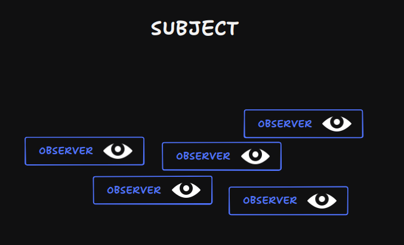

# Você nunca mais vai conseguir ler um código da mesma forma...

> "É sério! Você vai se sentir mais inteligente, quando aprender esse 
    design pattern e o motivo é bem simples, eu vou explicar ele de uma
    forma que você vai começar a notar as linhas de seu código de uma
    forma diferente, de uma forma mais sofisticada." - Filipe Deschamps

Essa são as primeiras frases dita pelo Filipe, explica bem o que
terá nessa leitura. Afinal esse documento não passa de um vídeo 
manuescrito para facilitar o aprendizado de minha humilde pessoa.

## Aprendizados contido nessa parte:
- Arquitetura de software;
- principalmente desacoplamento

No última capitulo terminamos com uma albúrdia de código! 
com responsábilidades espalhadas com má pratica de desenvolvimento.
Mas como identificamos se aquela parte do código está no lugar correto?
Filipe trás uma pergunta milagrosa:

"Mas de início é dificil perceber issso, é ainda mais difícil conseguir
entender que está acoplado ou não então para treinar seu cérebro a cobrar
isso do seu código  nada melhor do que sempre se fazer um questionamento,
se fazer uma pergunta a cada linha de código e essa pergunta é bem simples
...." 

## De quem é esse código???
"E se você continuamente fizer essa pergunta você vai começar a presta atenção
na resposta e ai a sua cabeça vai entrar em uma recursão maluca, porque dai você
vai começar a se perguntar se essa resposta está certa, é isso que vai começar
a mostrar as divisorias do seu sistema, os limites de seus componentes e se um está
acoplado ao outro ou quando o componente está acoplado ao outro."


## Estágios de desacoplamento

- 1° estágio: Quanto se tem vários códigos misturados tudo ao mesmo tempo
- 2° estáfio: Apesar dos componentes estarem isolados, um código conhece o outro.
- 3° estágio: Componentes isolados e que não se conhecem (Não existe declaraçao nem criação deles)


### Estágio 1

Código atual do projeto! Está uma bagunça com códigos do jogo misturado com inputs 
onde é dificil dizer de onde pertecem o código:

```JavaScript
const canvas = document.querySelector("#screen")

const contextGame = canvas.getContext('2d')
const game = {
    players : {
        'player1' : {
            x : 1,
            y : 1
        },
        'player2' : {
            x : 9,
            y : 9
        }
    },
    fruits : {
        'fruit1' :  {
            x : 4,
            y : 1
        }
    }
}

const currentPlayerId = 'player1'

document.addEventListener('keydown', handleKeydown)
function handleKeydown(event) {
    const player = game.players[currentPlayerId]
    

    if (event.key == 'ArrowUp' && player.y - 1 >= 0) {
        player.y -= 1
        console.log("tecla ativa: ", event.key)
    }
    console.log(canvas.width)
    console.log(player.y)
    if (event.key == 'ArrowDown' && player.y + 2 <= canvas.height) {
        player.y += 1
        console.log("tecla ativa: ", event.key)
    }

    if (event.key == 'ArrowRight' && player.x + 2 <= canvas.width) {
        console.log("tecla ativa: ", event.key)
        player.x += 1
    }

    if (event.key == 'ArrowLeft' && player.x - 1 >= 0)  {
        console.log("tecla ativa: ", event.key)
        player.x -= 1
    }
}
renderGame()
function renderGame() {

    //clear screen
    contextGame.clearRect(0,0, 10, 10) // mais performatico que apenas redesenhar um react ta tela inteira


    for (const playerId in game.players) {
            let currentPlayer = game.players[playerId]
        contextGame.fillStyle = "black"
        contextGame.fillRect(currentPlayer.x, currentPlayer.y, 1, 1)
    }

    for (const fruitId in game.fruits) {
        let currentFruit = game.fruits[fruitId]
        contextGame.fillStyle = "green"
        contextGame.fillRect(currentFruit.x, currentFruit.y, 1,1)
    }

    requestAnimationFrame(renderGame) // chama o método, fazendo com que atualize a tela a todo frame
}
```
Um não é pior que outro na pratica, pois o primeiro estágio é exelente para
prototipagem ou para entregar algo que precisar ser entrege de forma rápida!
Ou para testar se o que está sendo criado é útil ou funciona, ou até mesmo
para descobrir o que falta assim como entender melhor o que você está 
desenvolvendo. 


### 2° estágio de desacoplamento

  Componentes Separados, mas que ainda se conhecem! Vamos
separa-los mas ainda chamando um dentro do outro causando
dependencia. 

#### Refatorando

Para isolar as camadas vamos utilizar um design pattern chamado
Factory, ainda não iremos aprofundar muito sobre, começaremos separando
a camada de jogo. 

```JavaScript
    function createGame() {
        
        function movePlayer(comand) {
            console.log(`moving player ${command.playerId} with ${command.keyPressed} `)
        }
        
        return {
            movePlayer
        }
    }
```

O que fizemos? criamos a factory da camada de jogo,
onde conterá os códigos de regras de jogo que retorna um
objeto que será as regras do game. 

agora vamos refazer a implementação de movimentação do player, 
que ainda não está boa e necessita de melhoria.

Lembrando que quanto menos resistência você tiver para deletar 
código melhor irá evoluir! 
```JavaScript
    //vamos excluir toda lógica do handleKey e colocar no por enquanto na factory do game
    function createGame() {
    
        function movePlayer(command) {
            console.log(`moving player ${command.playerId} with ${command.keyPressed} `)

            const player = state.players[command.playerId]

            if (command.keyPressed == 'ArrowUp' && command.player.y >= 0) {
                command.player.y--
            }

            if (command.keyPressed == 'ArrowDown' && command.player.y + 1 <= canvas.height) {
                player.y++
            }

            if (command.keyPressed == 'ArrowLeft' && command.player.x - 1 >= canvas.width) {
                player.x--
            }

            if (command.keyPressed == 'ArrowRight' && command.player.x < canvas.width) {
                player.x++
            } 
        }
        
        return {
            movePlayer
        }
    }
```

agora fizemos o encapsulamento ou isolamento da camada
de jogos, a regra de negócio de movimentação ainda não
está boa, mas logo iremos melhorá-lo.

#### Código final do 2° estágio de desacoplamento 
```JavaScript
const canvas = document.querySelector("#screen")

const contextScreen = canvas.getContext('2d')


const currentPlayerId = 'player1'

document.addEventListener('keydown', handleKeydown)

function handleKeydown(event) {
    const player = state.players[currentPlayerId]
    
    const command = {
        playerId : 'player1',
        keyPressed :  event.key
    }

    game.movePlayer(command)
}

function createGame() {

    const state = {
    players : {
            'player1' : {
                x : 1,
                y : 1
            },
            'player2' : {
                x : 9,
                y : 9
            }
        },
        fruits : {
            'fruit1' :  {
                x : 4,
                y : 1
            }
        }
    }
    
    function movePlayer(command) {
        console.log(`moving  ${command.playerId} with ${command.keyPressed}`)
        const player = state.players[command.playerId]
        console.log("tamanho da altura do canvas", canvas.height)
        console.log(player)
        if (command.keyPressed == "ArrowUp" && player.y > 0) {
            player.y -= 1
        }

        if (command.keyPressed == 'ArrowDown' && player.y + 1 < canvas.height) {
            player.y += 1
        }
        
        if (command.keyPressed == 'ArrowLeft' && player.x - 1 >= 0) {
            player.x -= 1
        }

        if (command.keyPressed == 'ArrowRight' && player.x + 1 < canvas.width) {
            player.x += 1
        }
    }

    return {
        movePlayer
        state
    }
}

const game = createGame()

renderstate()
function renderstate() {

    //clear screen
    contextScreen.clearRect(0,0, 10, 10) // mais performatico que apenas redesenhar um react ta tela inteira


    for (const playerId in game.state.players) {
            let currentPlayer = game.state.players[playerId]
        contextScreen.fillStyle = "black"
        contextScreen.fillRect(currentPlayer.x, currentPlayer.y, 1, 1)
    }

    for (const fruitId in game.state.fruits) {
        let currentFruit = game.state.fruits[fruitId]
        contextScreen.fillStyle = "green"
        contextScreen.fillRect(currentFruit.x, currentFruit.y, 1,1)
    }

    requestAnimationFrame(renderstate) // chama o método, fazendo com que atualize a tela a todo frame
}
```

### 3° estágio de desacoplamento

Agora a coisa fica muito interessante e maluca! vamos utilizar
o **design pettern** chamado **obsover** e como ele funciona?
Inicialmente terá um objeto chamado de **Subject**, veja ele
como objeto principal que será observado, mas observado por quêm??
Então entra os **Observer** que são objetos que iram observar o 
**subject**.



O que significa que qualquer mudança em seu estado,
ou comportamento ele irá mandar uma notificação para
todos **observer**, se a notificação for relevante para
o **observer** ele fará o que bem entender com essa
informação.

#### Subject é poucas ideias
Uma característa importante sobre o **subject** para
ele não importa se algum observer está observando ele
ou se a notificação é relevante para os observers, ele
irá notificar todo mundo! O observer terá a responsabilidade
de avaliar se aquela notificação é relevante para ele
ou não. 


Mas depois de toda essa explicação, pode surgir uma dúvida,
para quem eu devo oferecer o poder de subject, de notificar 
os **observer** e a quem devo confiar o poder de **observer**??

Bom, não existe regra! tecnicamente é ilimitado as opções, é 
questão de implementar os métodos certos para os objetos.

Nesse exemplo, o Filipe irá transformar o handleKeydown em um
subject! para notificar as teclas pressionadas, partiu refatoraçãoo!!

#### Inicialmente é necessário transformar o handleKeydown em uma factory

```JavaScript

function createKeyboardListenner() {

    document.addEventListenner('keydown', handleKey)

    function handleKeydown(event) {
        const command = {
            playerId : 'player1',
            keyPressed : event.key
        }

        game.moveplayer(command)
    }
}

```

Agora o handlekey se tornou um factory, agora basta transformar
ela em um subject, e isso é tranquilo!!

