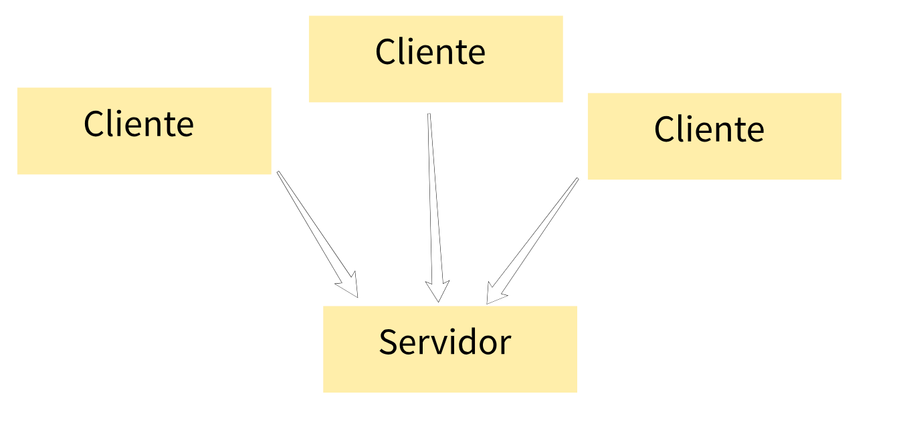

# Jogo online
Esse projeto também foi criado pelo Filipe Deschamps (todos os creditos vai para ele). Estou apenas documentando minha tentativa de melhorar como programador.

## Overview 

O jogo será composto por um **cliente** e um **servidor** que
é bem comum, é importatante notar que para um mesmo servidor você
pode e deve conectar a vários clientes.

## Responsabilidades do jogo

- Apresentação : onde vai aparecer de fato as coisas na tela;
- Lógica + dados;
- Inputs;
- Networking.

### Apresentação
   Camada responável apenas pela exibição de gráficos, somos
seres bem visuais e achamos que tudo que a gente vê está condensado apenas ali. Mas não, uma impressora não sabe escrever um artigo com normas ortogrâficas (nem eu aparentimente). A impressora só tem como papel imprimir o que foi escrito. Um arquivo word que está dentro de seu computador. 

### Lógica mais dados

  E se a camada de apresentação só tem a responsabilidade de
exibir os gráficos do jogo, como ele sabe que deve redesenhar algo? É aí que entra a camada de lógica e dados.
  E a camada que guarda todas as informações do jogo, que guarda
o **estado do jogo**, Porém essa camada guarda de forma "abstrata".  Como isso é um projeto simples, o Filipe optou por juntar lógica com dados para simplificar o projeto. Lógica/regras de negócio são as ações que o jogo consegue fazer seja aperta um botão e ele andar para baixo etc... 

### Inputs
  Essa camada captura as ações do jogador, sem essa camada o jogo
não aconteceria, uma camada simples, porém importante! 

### Networking
  É ela a responsável por **sincronizar** todo mundo com o server
permitindo que o jogo seja atualizado a todo momento.
